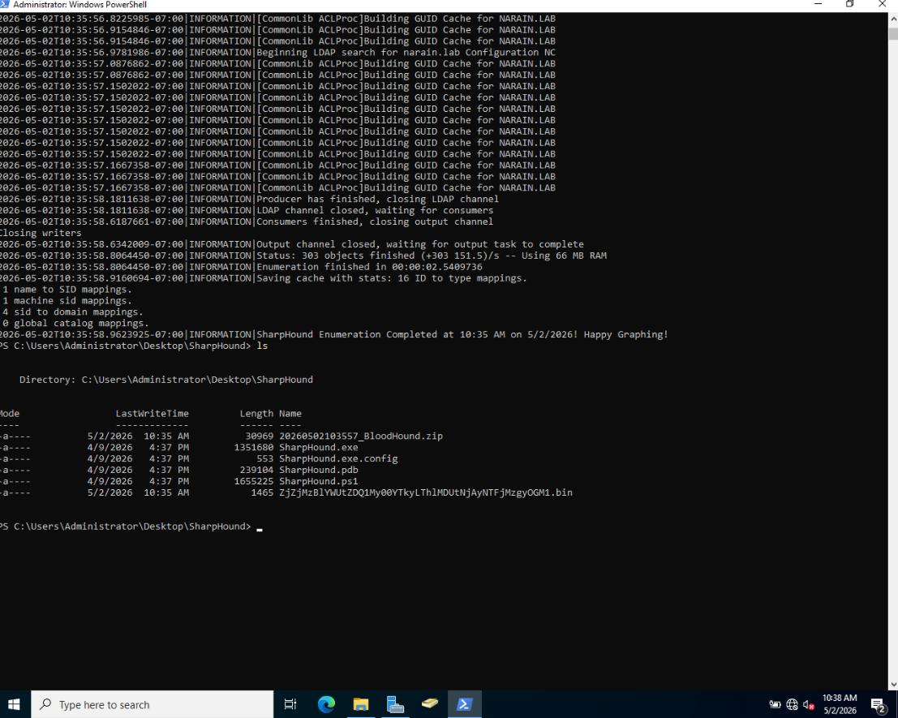
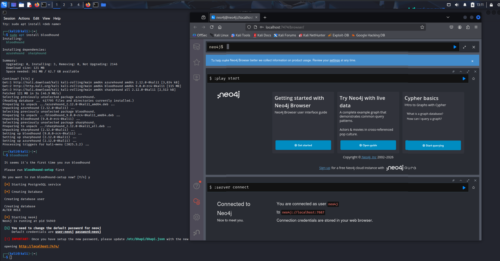
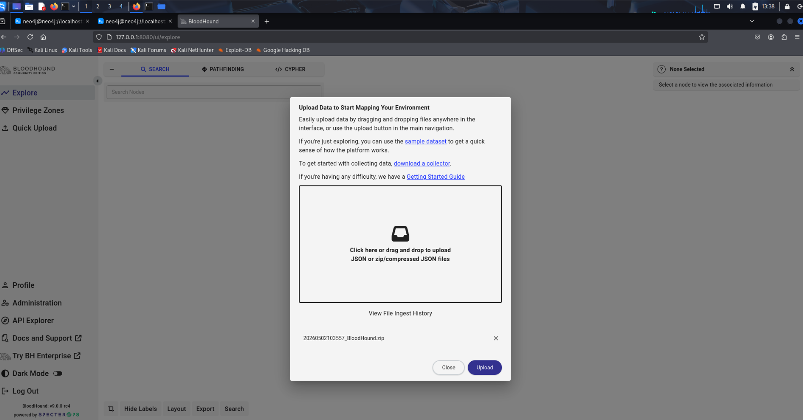
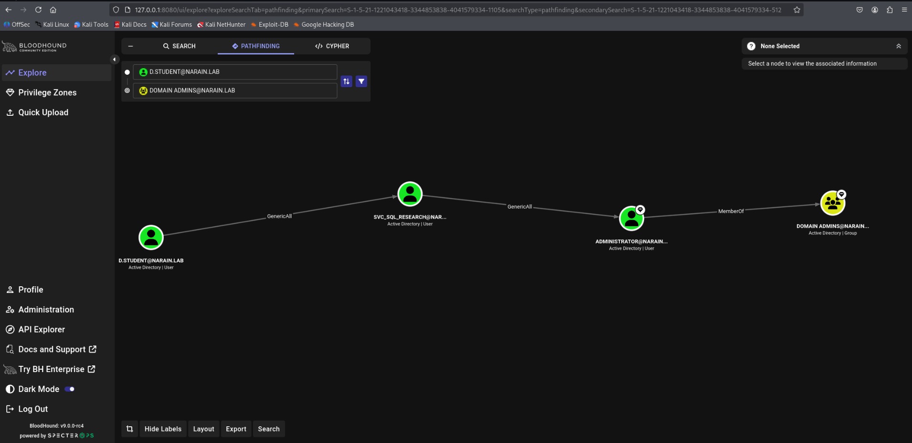
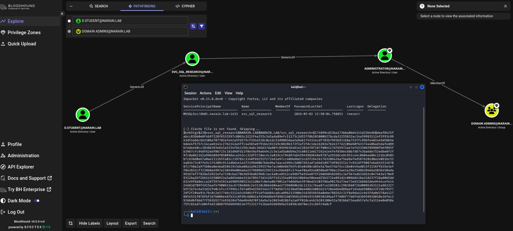
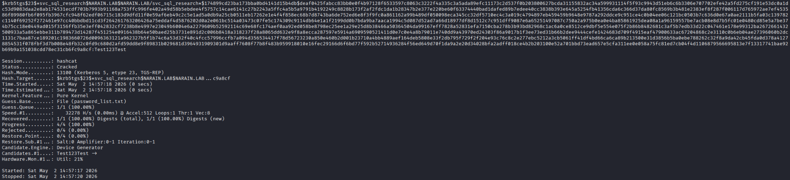
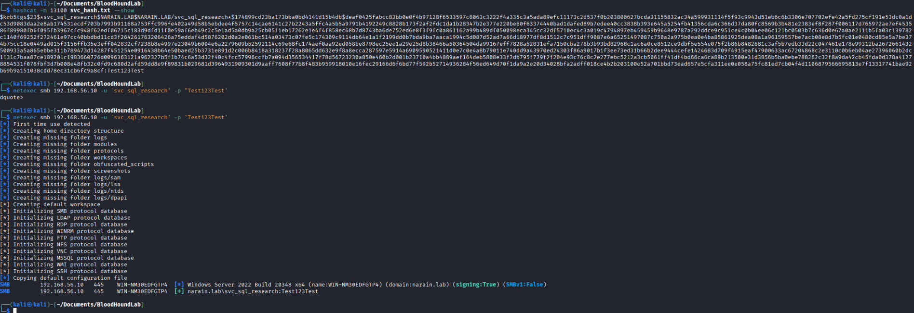

# Lab Report: Active Directory Identity Escalation Path

**Author:** Dylan Matthew Narain

**Date:** May 2, 2026

**Focus:** Identity Security, Privilege Escalation, and Kerberoasting

**Environment:** `narain.lab` (Isolated Lab Environment)

---

## 1. Executive Summary
This report documents a successful identity-based attack path originating from a low-privileged user account. By exploiting insecure Active Directory permissions and leveraging a Kerberoasting attack, I achieved a total forest compromise.

## 2. Phase I: Reconnaissance & Enumeration
Internal mapping was performed using **SharpHound** to identify permission-based attack vectors.

**Execution:**
`.\SharpHound.exe -c All --domain narain.lab`

## 3. Phase II: Attack Path Analysis
The data was ingested into **BloodHound** to visualize the shortest path to Domain Admin.

## 4. Phase III: Kerberoasting & Cracking
Since the service account had an SPN, it was targeted to retrieve an NTLM hash via Kerberoasting.

## 5. Phase IV: Final Validation
Authentication was verified using `netexec` to confirm administrative control over the Domain Controller.

